# bpmn-mapper

A [Claude Code](https://claude.com/claude-code) skill that has an AI agent map
your application's **business processes** — not its call graph — from your
source code, and emit the result as valid BPMN 2.0. Point it at a codebase
(routes/controllers, queue consumers, cron jobs, status enums, webhooks,
payment/auth/email flows) and it reconstructs the business process behind
them: actors become pools/lanes, decisions become gateways, waits/timeouts
become timer events, inbound webhooks become message events. The diagram is
always run through a real parser and semantic validator before it's handed
back, so it passes structural checks (reachability, start/end rules, pool
crossing, known ids). Whether it models your process correctly still needs a
human review against the code. You can open it directly in
[bpmn.io](https://demo.bpmn.io/) or Camunda Modeler.

## Example

`skill/examples/order-fulfillment.mmd` — a small order-fulfillment flow with
two pools, lanes, and a message flow between them:

```
bpmn LR
  pool "Customer"
    start c0 "Order needed"
    task:user c1 "Submit order"
    end c2 "Order submitted"
  pool "Shop"
    lane "Sales"
      start message s1 "Receive order"
      task:user t1 "Review order"
      xor g1 "Items available?"
    lane "Warehouse"
      task:user t2 "Pick and pack order"
      task:user t3 "Dispatch order"
      end e1 "Order shipped"
      end e2 "Order backordered"
  c0 --> c1 --> c2
  s1 --> t1 --> g1
  g1 -- "Yes" --> t2 --> t3 --> e1
  g1 -->|default| e2
  c1 ==>|"Order"| s1
```

Rendered (`skill/examples/order-fulfillment.svg`):



`skill/examples/order-fulfillment.bpmn` is the same flow exported as BPMN 2.0
XML with layout (BPMNDI) — open it in bpmn.io or Camunda Modeler.
`skill/examples/media-viewer-upload.mmd` is a second, real example mapped
end-to-end from an Express app, carrying the `%% source:` provenance and
`%% evidence` comments used to keep maps up to date. `skill/examples/broken-example.mmd` is
deliberately invalid — run it through `validate.mjs` to see the
self-correcting error catalogue in action.

## Install

### Option A: Claude Code plugin (recommended)

This repo is its own [Claude Code plugin marketplace](https://code.claude.com/docs/en/plugins/create-marketplace)
(`.claude-plugin/marketplace.json` + `.claude-plugin/plugin.json`). Install
from your shell:

```sh
claude plugin marketplace add rwspatin/bpmn-skill
claude plugin install bpmn-mapper@rwspatin
```

Or, in one step from inside a Claude Code session (requires Claude Code
v2.1.275+):

```
/plugin install bpmn-mapper --marketplace rwspatin/bpmn-skill
```

Get updates later with:

```sh
claude plugin update bpmn-mapper@rwspatin
```

The plugin's `plugin.json` intentionally omits `version`, so Claude Code
tracks the marketplace repo's commit SHA — every push to `main` is an update,
no version bump needed.

Plugin skills are namespaced under the plugin's name when invoked directly
(e.g. `/bpmn-mapper:...`), but this skill is primarily **model-invoked**:
Claude auto-triggers it from its description (the "mapear
fluxos/processos", "gerar BPMN do código", "business process from code"
phrases in `skill/SKILL.md`'s frontmatter) rather than needing an explicit
slash command. Run `claude plugin details bpmn-mapper` after installing to
see the exact skill name and invocation Claude Code registered for your
version.

### Option B: manual symlink

1. Clone this repo:
   ```sh
   git clone https://github.com/rwspatin/bpmn-skill.git
   ```
2. Make the skill visible to Claude Code by symlinking (or copying) `skill/`
   into your skills directory:
   ```sh
   ln -s "$(pwd)/bpmn-skill/skill" ~/.claude/skills/bpmn-mapper
   ```
3. Requires **Node >= 22**.
   - `validate.mjs`, `lint.mjs`, `export-xml.mjs` and `diff-map.mjs` are
     self-contained (they use a vendored, pre-built parser/exporter bundle) and
     work fully offline — nothing further to install for those.
     `changed-since.mjs` additionally needs `git` on the PATH.
   - `render.mjs` (SVG preview) needs the Mermaid fork this skill's `bpmn`
     DSL comes from, checked out and built, because it drives the real
     renderer in headless Chromium:
     ```sh
     git clone https://github.com/rwspatin/mermaid.git
     cd mermaid
     git checkout feat/bpmn-diagram
     pnpm install
     pnpm build:mermaid
     pnpm exec playwright install chromium   # browser used for headless rendering
     export BPMN_MERMAID_FORK="$(pwd)"   # required — render.mjs has no default path
     ```

## Usage

From `skill/`:

```sh
node scripts/validate.mjs   path/to/flow.mmd            # -> "VALID" (exit 0) or catalogue errors (exit 1)
node scripts/lint.mjs       path/to/flow.mmd [--json]   # -> "CLEAN" (exit 0) or style warnings L1-L8 (exit 1)
node scripts/export-xml.mjs path/to/flow.mmd out.bpmn   # -> BPMN 2.0 XML with BPMNDI (bpmn.io-ready)
node scripts/render.mjs     path/to/flow.mmd out.svg    # -> headless SVG preview (needs BPMN_MERMAID_FORK, see above)
node scripts/changed-since.mjs <map-dir> --repo <name>=<path> [--json]  # -> which diagrams/rules the code changed since the map was traced
node scripts/diff-map.mjs   old.mmd new.mmd [--json]    # -> semantic diff of two diagrams (by id) + id-churn hints
```

`lint.mjs` is a deterministic style linter that runs after `validate.mjs`: it
checks the BPMN method/style rules (question-labeled gateways, labeled and
default branches, parallel split/join pairing, named start/end events and
message flows, business-language labels) and prints self-correcting warnings,
so those checks live in the CLI rather than only in the skill's prose.

`changed-since.mjs` and `diff-map.mjs` drive incremental updates (next
section). `changed-since.mjs` exits 0 when nothing is affected, 1 when a diagram
or rule is affected, 2 on usage/git errors; `diff-map.mjs` exits 0 for no
semantic change, 1 for changes, 2 if a file does not parse/validate. Both take
`--json`.

As a Claude Code skill, the normal path is conversational: ask Claude to map
a codebase's business flows to BPMN, and it follows `skill/SKILL.md`'s
workflow — discover flows, model them per `skill/references/mapping-playbook.md`,
emit the DSL per `skill/references/dsl-spec.md`, validate and self-correct
with `validate.mjs`, then optionally render/export. See `skill/SKILL.md` for
the full workflow and modeling rules.

## Keeping maps up to date

Re-running the skill on a codebase it already mapped does **not** regenerate
the map. Every diagram records where it was traced from:

```
%% source: media-viewer b97c9bf93725c4585e1bdf2078e4f7f8ee7467b2 2026-09-24
%% evidence t1: media-viewer:server.js:318-328
```

(`%%` lines are comments: they don't change validation, rendering or export.)
On a re-run the agent:

1. runs `changed-since.mjs <map-dir> --repo media-viewer=../media-viewer`, which
   diffs each recorded commit against `HEAD` (read-only git) and maps the
   changed files onto diagrams through the evidence — `%% evidence` comments
   and/or a `RULES.md` table with an Evidence column. It lists affected
   diagrams (and the rules/elements behind them), rules whose evidence file was
   deleted or renamed, and changed files no rule covers (possible new flows);
2. re-traces only the affected diagrams and edits them minimally — existing ids
   and unchanged labels stay verbatim, new elements get new ids, unaffected
   diagrams stay byte-identical;
3. validates and lints, then runs `diff-map.mjs old.mmd new.mmd` to check that
   every semantic change (node/flow added, removed, relabelled, retyped, moved)
   is intended. It also hints at "id churn" — an element seemingly re-created
   under a new id (same type + label): a strong hint when it sits in the same
   pool/lane with a shared neighbour, a "possible" one otherwise. Every hint is
   reviewed; the old id is restored only when it is really the same element;
4. bumps the `%% source:` line of re-traced diagrams to the new commit, fixes
   the evidence line numbers, and re-renders only what changed.

The result is a small, reviewable diff instead of a full regeneration. The
conventions are specified in `skill/references/dsl-spec.md` (Part 4) and the
procedure in `skill/SKILL.md` ("Update mode").

## Layout

- `.claude-plugin/plugin.json` + `.claude-plugin/marketplace.json` — make
  this repo installable as a Claude Code plugin (`bpmn-mapper@rwspatin`, see
  [Install](#install)). `plugin.json`'s `skills` field points at `./skill/`
  directly, so the skill's files stay exactly where the manual-symlink
  install expects them — no files moved.
- `skill/` — the skill itself (this is what you symlink into
  `~/.claude/skills/bpmn-mapper` for a manual install).
  - `SKILL.md` — name, triggers (PT + EN), workflow, modeling rules.
  - `references/dsl-spec.md` — prompt-ready DSL spec + the full
    self-correcting error catalogue.
  - `references/mapping-playbook.md` — code→BPMN heuristics + worked
    examples.
  - `scripts/` — `validate.mjs`, `lint.mjs`, `export-xml.mjs`, `render.mjs`,
    `changed-since.mjs`, `diff-map.mjs` (tests: `lint.test.mjs`,
    `update.test.mjs`, fixtures in `test-fixtures/`), plus
    `vendor/bpmn-core.mjs` (the vendored parser bundle) and
    `lib/rebuild.mjs` (regenerates that bundle from the fork).
  - `examples/` — validated `.mmd` files (+ `.bpmn`, `.svg`).

## Status & upstream tracking

The `bpmn` diagram DSL, parser, semantic validator, and XML exporter live in
the author's Mermaid fork, **not upstream Mermaid** — `feat/bpmn-diagram` on
[`rwspatin/mermaid`](https://github.com/rwspatin/mermaid). This skill vendors
a compiled bundle of that fork's parser/validator/exporter
(`skill/scripts/vendor/bpmn-core.mjs`, see `THIRD_PARTY_NOTICES.md`) so
`validate.mjs`/`export-xml.mjs` run standalone, and calls the fork's real
built renderer for `render.mjs`.

Two upstream PRs track getting BPMN, and this skill's AI-first layer, into Mermaid:

- [mermaid-js/mermaid#8313](https://github.com/mermaid-js/mermaid/pull/8313)
  — the author's draft PR adding this `bpmn` diagram type and its XML export
  directly to mermaid-js/mermaid. Kept open as a draft reference.
- [filipsajdak/mermaid#1](https://github.com/filipsajdak/mermaid/pull/1) —
  the author's PR into Filip Sajdak's `bpmn-beta` stack, adding tolerant
  keywords, opt-in `bpmn.strict` semantic validation, and a prompt-ready
  spec. `bpmn-beta` is tracked upstream as
  [mermaid-js/mermaid#8160](https://github.com/mermaid-js/mermaid/issues/8160);
  the diagram PR for that stack is
  [mermaid-js/mermaid#8166](https://github.com/mermaid-js/mermaid/pull/8166);
  the original BPMN support request is
  [mermaid-js/mermaid#2623](https://github.com/mermaid-js/mermaid/issues/2623).

Plan: migrate this skill to `bpmn-beta` syntax if/when that stack merges
upstream. Where the BPMN 2.0 XML export ends up living (in-repo vs. a
separate package) is still an open question, pending a maintainer decision on
#2623. Until then, this skill depends on the fork directly, as described
above.

## License

This repository's own code is MIT — see `LICENSE`. The vendored bundle
(`skill/scripts/vendor/bpmn-core.mjs`) embeds third-party code (Mermaid,
Chevrotain, and their dependencies) under their own licenses — see
`THIRD_PARTY_NOTICES.md`.
